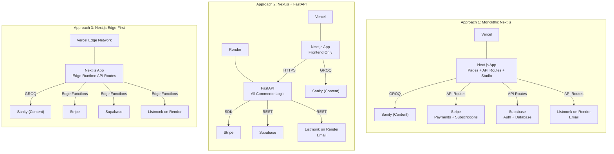
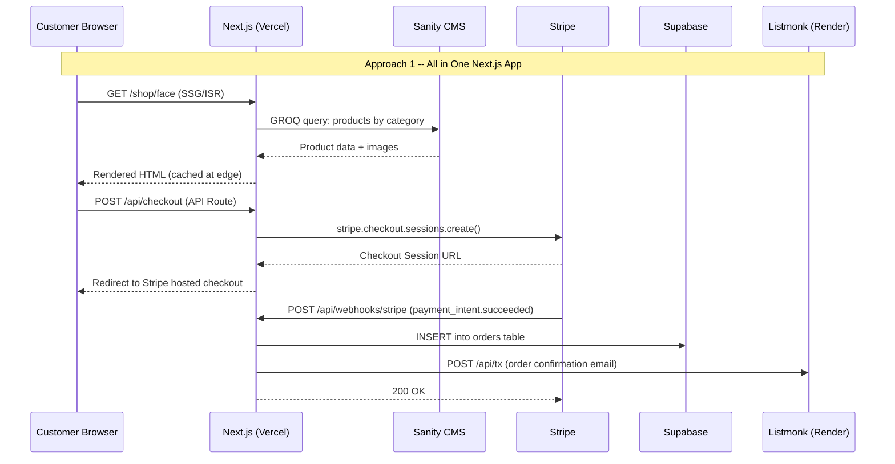
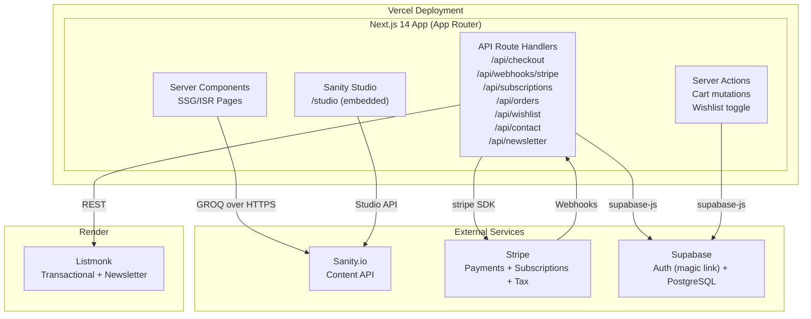
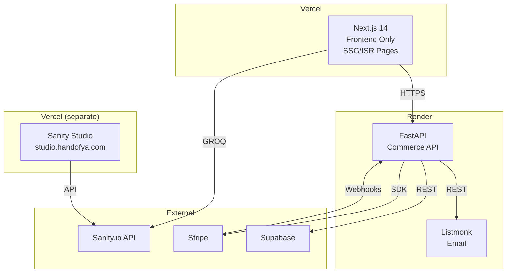
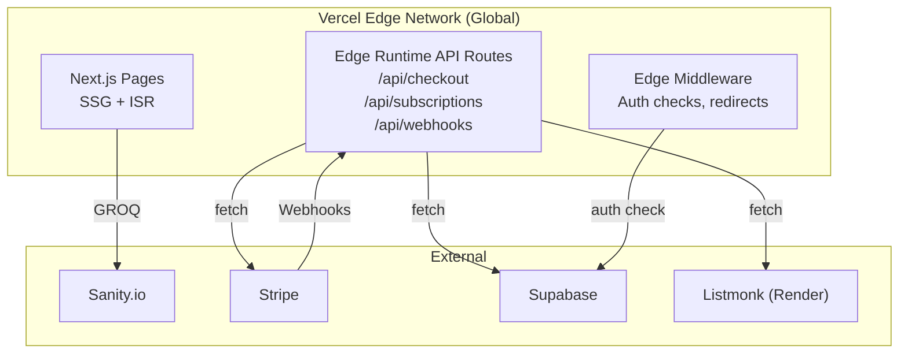

# Hand of Yah -- Architecture

**Document version:** 1.0
**Created:** 2026-03-27
**Status:** Draft
**Recommendation:** Approach 1 (Monolithic Next.js)

---

## Visual Overview





---

## Codebase Patterns Found

| Pattern | Source | Reuse for Hand of Yah |
|---|---|---|
| Supabase singleton client | `secureclear/web/src/lib/supabase.ts` | Copy verbatim, same `getSupabaseClient()` pattern |
| Magic link auth + callback | `secureclear/web/src/app/(auth)/auth/callback/page.tsx` | Adapt: remove broker profile fetch, redirect to `/account` instead of `/dashboard` |
| Route groups | `secureclear/web/src/app/(auth)/`, `(portal)/` | Use `(account)/` for authenticated customer pages, `(checkout)/` for checkout isolation |
| Tailwind brand tokens in config | `secureclear/web/tailwind.config.js` | Same structure: extend colors, fontFamily; use Hand of Yah palette |
| Global component classes | `secureclear/web/src/app/globals.css` under `@layer components` | Define `.btn-primary`, `.product-card`, `.section-container` etc. |
| Typed API client module | `secureclear/web/src/lib/api.ts` | Build `lib/commerce.ts` for Stripe/Supabase calls, `lib/sanity.ts` for GROQ |
| Metadata in root layout | `secureclear/web/src/app/layout.tsx` | Same approach: `export const metadata: Metadata` with OG tags |
| Server Components default | SecureClear pages are `'use client'` only when interactive | Keep: product listing/detail pages as Server Components; cart/checkout as client |

---

## Approach 1: Monolithic Next.js (Recommended)

### Architecture Diagram



### Description

Everything lives in a single Next.js application deployed to Vercel. Product pages, journal posts, and content pages are Server Components fetching from Sanity at build time (SSG) or on demand with revalidation (ISR). Commerce operations (checkout, subscription management, order queries) are handled by Next.js API Route Handlers. Sanity Studio is embedded at `/studio` using the `next-sanity` plugin, giving the owner a single URL for both the website and content management.

Listmonk is the only separately deployed service, running as a Docker container on Render. It handles both transactional emails (order confirmation, subscription reminders) and newsletter management.

This approach is justified because Hand of Yah's API surface is thin: Stripe SDK calls, Supabase CRUD, and Listmonk REST calls. There is no CPU-intensive processing, no long-running background jobs, and no need for Python-specific libraries. SecureClear needed a separate FastAPI backend because its security scanner engine runs CPU-bound processes in a `ProcessPoolExecutor`. Hand of Yah has no equivalent workload.

### Technology Choices

| Layer | Technology | Version | Rationale |
|---|---|---|---|
| Framework | Next.js (App Router) | 15.x | Latest stable; Server Components, ISR, API Routes, Server Actions |
| Language | TypeScript | 5.x | Strict mode, factory convention |
| Styling | Tailwind CSS | 3.4.x | Factory convention; brand tokens in config |
| CMS | Sanity | v3 | Structured content, Studio UI, `next-sanity` for embedded studio |
| CMS Client | `next-sanity` + `@sanity/image-url` | latest | GROQ queries + image pipeline |
| Content Rendering | `@portabletext/react` | latest | Sanity Portable Text rendering |
| Payments | Stripe | `stripe` (Node SDK) v17.x | Server-side only; Checkout Sessions + Subscriptions + Tax |
| Payment UI | `@stripe/stripe-js` + `@stripe/react-stripe-js` | latest | Stripe Elements for embedded payment form |
| Auth | Supabase Auth | `@supabase/supabase-js` v2.x | Magic link (passwordless), same as SecureClear |
| Database | Supabase PostgreSQL | - | Orders, customers, subscriptions, wishlists |
| Validation | Zod | v3.x | API route input validation (per standards) |
| Email | Listmonk | v4.x (Docker on Render) | Self-hosted newsletter + transactional |
| Analytics | Vercel Analytics or Plausible | - | Privacy-respecting, lightweight |
| Hosting | Vercel | - | Hard constraint from PRD |
| Testing (E2E) | Playwright | latest | Factory convention |
| Linting | ESLint + Prettier | latest | Factory convention |

### Components

| Component | File Path | Responsibility |
|---|---|---|
| Root layout | `web/src/app/layout.tsx` | HTML shell, metadata, header/footer, fonts |
| Sanity client | `web/src/lib/sanity.ts` | GROQ query helpers, singleton client, image URL builder |
| Supabase client | `web/src/lib/supabase.ts` | Auth and database singleton (copied from SecureClear) |
| Commerce client | `web/src/lib/stripe.ts` | Server-side Stripe SDK initialization |
| Cart context | `web/src/lib/cart.ts` | Cart state: localStorage for guests, Supabase for authenticated |
| API: Checkout | `web/src/app/api/checkout/route.ts` | Creates Stripe Checkout Session or Payment Intent |
| API: Webhooks | `web/src/app/api/webhooks/stripe/route.ts` | Handles Stripe events, creates orders, triggers emails |
| API: Subscriptions | `web/src/app/api/subscriptions/route.ts` | List/update/cancel customer subscriptions |
| API: Orders | `web/src/app/api/orders/route.ts` | List customer order history |
| API: Wishlist | `web/src/app/api/wishlist/route.ts` | CRUD for wishlist items |
| API: Contact | `web/src/app/api/contact/route.ts` | Contact form submission |
| API: Newsletter | `web/src/app/api/newsletter/route.ts` | Listmonk subscriber creation |
| Product pages | `web/src/app/shop/[slug]/page.tsx` | Product detail (SSG with ISR) |
| Category pages | `web/src/app/shop/[category]/page.tsx` | Category grid (SSG with ISR) |
| Sanity Studio | `web/src/app/studio/[[...tool]]/page.tsx` | Embedded Sanity Studio |
| Sanity schemas | `web/src/sanity/schemas/` | Product, Category, JournalPost, LearnArticle, Ingredient, Page |
| Design tokens | `web/tailwind.config.ts` | Colors, fonts, spacing, brand system |
| Global styles | `web/src/app/globals.css` | Tailwind directives + `@layer components` classes |

### Directory Structure

```
projects/handofya/
├── web/                                    # Next.js app (deploys to Vercel)
│   ├── src/
│   │   ├── app/
│   │   │   ├── layout.tsx                  # Root layout (header, footer, fonts, metadata)
│   │   │   ├── page.tsx                    # Homepage
│   │   │   ├── globals.css                 # Tailwind + global component classes
│   │   │   ├── (shop)/
│   │   │   │   ├── shop/
│   │   │   │   │   ├── page.tsx            # All products
│   │   │   │   │   └── [category]/
│   │   │   │   │       └── page.tsx        # Category pages (Face, Supplements, etc.)
│   │   │   │   └── shop/[slug]/
│   │   │   │       └── page.tsx            # Product detail page
│   │   │   ├── (content)/
│   │   │   │   ├── journal/
│   │   │   │   │   ├── page.tsx            # Journal listing
│   │   │   │   │   └── [slug]/page.tsx     # Journal post
│   │   │   │   ├── learn/
│   │   │   │   │   ├── page.tsx            # Learn hub
│   │   │   │   │   └── [slug]/page.tsx     # Learn article
│   │   │   │   ├── ingredients/
│   │   │   │   │   ├── page.tsx            # Ingredient database
│   │   │   │   │   └── [slug]/page.tsx     # Ingredient detail
│   │   │   │   ├── about/page.tsx
│   │   │   │   ├── contact/page.tsx
│   │   │   │   ├── faq/page.tsx
│   │   │   │   ├── shipping-returns/page.tsx
│   │   │   │   ├── terms/page.tsx
│   │   │   │   └── privacy/page.tsx
│   │   │   ├── (account)/
│   │   │   │   ├── layout.tsx              # Auth guard layout
│   │   │   │   ├── account/
│   │   │   │   │   ├── page.tsx            # Account dashboard
│   │   │   │   │   ├── orders/page.tsx
│   │   │   │   │   ├── subscriptions/page.tsx
│   │   │   │   │   ├── wishlist/page.tsx
│   │   │   │   │   └── settings/page.tsx
│   │   │   ├── (auth)/
│   │   │   │   ├── login/page.tsx
│   │   │   │   ├── signup/page.tsx
│   │   │   │   └── auth/callback/page.tsx  # Magic link callback
│   │   │   ├── (checkout)/
│   │   │   │   ├── layout.tsx              # Minimal layout (no header/footer)
│   │   │   │   ├── cart/page.tsx           # Full cart page
│   │   │   │   └── checkout/page.tsx       # Single-page checkout
│   │   │   ├── studio/[[...tool]]/
│   │   │   │   └── page.tsx                # Embedded Sanity Studio
│   │   │   └── api/
│   │   │       ├── checkout/route.ts
│   │   │       ├── webhooks/stripe/route.ts
│   │   │       ├── subscriptions/
│   │   │       │   ├── route.ts
│   │   │       │   └── [id]/route.ts
│   │   │       ├── orders/route.ts
│   │   │       ├── wishlist/
│   │   │       │   ├── route.ts
│   │   │       │   └── [slug]/route.ts
│   │   │       ├── contact/route.ts
│   │   │       ├── newsletter/route.ts
│   │   │       └── revalidate/route.ts     # Sanity webhook -> ISR revalidation
│   │   ├── components/
│   │   │   ├── layout/
│   │   │   │   ├── Header.tsx
│   │   │   │   ├── Footer.tsx
│   │   │   │   ├── MobileNav.tsx
│   │   │   │   └── CartDrawer.tsx
│   │   │   ├── product/
│   │   │   │   ├── ProductCard.tsx
│   │   │   │   ├── ProductGrid.tsx
│   │   │   │   ├── ProductImages.tsx
│   │   │   │   ├── SubscriptionToggle.tsx
│   │   │   │   └── AddToCart.tsx
│   │   │   ├── cart/
│   │   │   │   ├── CartLineItem.tsx
│   │   │   │   └── CartSummary.tsx
│   │   │   ├── checkout/
│   │   │   │   ├── CheckoutForm.tsx
│   │   │   │   └── StripeElements.tsx
│   │   │   ├── content/
│   │   │   │   ├── PortableText.tsx
│   │   │   │   ├── JournalCard.tsx
│   │   │   │   └── IngredientList.tsx
│   │   │   ├── account/
│   │   │   │   ├── OrderList.tsx
│   │   │   │   ├── SubscriptionCard.tsx
│   │   │   │   └── WishlistGrid.tsx
│   │   │   └── ui/
│   │   │       ├── Button.tsx
│   │   │       ├── Input.tsx
│   │   │       ├── NewsletterForm.tsx
│   │   │       └── SocialShare.tsx
│   │   ├── lib/
│   │   │   ├── sanity.ts               # Sanity client + GROQ helpers
│   │   │   ├── sanity-image.ts         # Image URL builder
│   │   │   ├── supabase.ts             # Supabase client singleton
│   │   │   ├── supabase-server.ts      # Server-side Supabase (for API routes)
│   │   │   ├── stripe.ts               # Stripe server SDK singleton
│   │   │   ├── stripe-client.ts        # Stripe.js client initialization
│   │   │   ├── cart.ts                 # Cart logic (localStorage + Supabase)
│   │   │   ├── listmonk.ts            # Listmonk REST API client
│   │   │   ├── types.ts               # Shared TypeScript interfaces
│   │   │   └── constants.ts           # Site-wide constants
│   │   └── sanity/
│   │       ├── config.ts              # Sanity project config
│   │       ├── schemas/
│   │       │   ├── index.ts
│   │       │   ├── product.ts
│   │       │   ├── category.ts
│   │       │   ├── journalPost.ts
│   │       │   ├── journalCategory.ts
│   │       │   ├── learnArticle.ts
│   │       │   ├── ingredient.ts
│   │       │   └── page.ts
│   │       └── lib/
│   │           └── queries.ts         # GROQ query strings
│   ├── public/
│   │   ├── fonts/                     # Self-hosted web fonts (variable)
│   │   └── images/                    # Static brand assets, favicon
│   ├── package.json
│   ├── next.config.ts
│   ├── tailwind.config.ts
│   ├── tsconfig.json
│   ├── postcss.config.js
│   ├── .env.local.example
│   └── playwright.config.ts
├── docs/
│   ├── prd.md
│   ├── architecture.md (this file)
│   ├── tasks.md
│   ├── tasks.json
│   ├── codebase-analysis.md
│   ├── visual-audit.md
│   ├── design/
│   │   ├── brand-guidelines.md
│   │   ├── design-tokens.md
│   │   └── philosophy.md
│   ├── specs/
│   └── sessions/
└── .gitignore
```

### Data Flow: Key Operations

#### Product Browsing

```
1. Customer visits /shop/face
2. Next.js serves SSG page (or ISR-revalidated)
3. At build time / revalidation: GROQ query to Sanity
   - *[_type == "product" && category->slug.current == "face" && status == "active"]
4. Sanity returns product array with image refs
5. Images served via Sanity CDN (hot-linked, not downloaded)
6. Page renders Server Component with product grid
7. No JavaScript required for initial render
```

#### Checkout (One-time Purchase)

```
1. Customer clicks "Add to Cart" on product page
2. Client-side: item added to cart state (localStorage for guest)
3. Customer opens cart drawer, clicks "Checkout"
4. Customer fills shipping info on /checkout page
5. POST /api/checkout with cart items + shipping address
6. API route:
   a. Creates Stripe Checkout Session (line_items from cart, shipping_options, tax via Stripe Tax)
   b. Returns sessionId
7. Client redirects to Stripe hosted checkout (or renders Stripe Elements inline)
8. Customer completes payment on Stripe
9. Stripe sends webhook: payment_intent.succeeded
10. POST /api/webhooks/stripe:
    a. Verify signature with STRIPE_WEBHOOK_SECRET
    b. INSERT into orders table (Supabase)
    c. POST to Listmonk transactional API (order confirmation email)
    d. Return 200
11. Customer sees order confirmation page
```

#### Subscription Purchase

```
1. Customer toggles "Subscribe & Save" on product page, selects frequency
2. Cart line item flagged as subscription with frequency metadata
3. At checkout, API route creates:
   a. Stripe Customer (if new)
   b. Stripe Subscription with price recurring interval matching frequency
4. Stripe processes first payment
5. Webhook: invoice.paid
6. API creates order + subscription record in Supabase
7. Subsequent months: Stripe auto-charges, sends invoice.paid webhook
8. API creates new order for each renewal, sends Listmonk notification
```

#### Subscription Management

```
1. Customer visits /account/subscriptions (authenticated)
2. Page fetches GET /api/subscriptions (auth token in header)
3. API route:
   a. Verify Supabase auth token
   b. Query subscriptions table WHERE customer_id = user.id
   c. For each, call stripe.subscriptions.retrieve() for current status
   d. Return merged data
4. Customer clicks "Change Frequency" / "Pause" / "Cancel"
5. PATCH or DELETE /api/subscriptions/[id]
6. API route:
   a. stripe.subscriptions.update() or stripe.subscriptions.cancel()
   b. UPDATE subscriptions table in Supabase
   c. Return updated subscription
```

### Trade-offs

**Pros:**
- Single codebase, single deployment, single CI/CD pipeline
- Vercel handles scaling, CDN, SSL, edge caching automatically
- No cross-service communication latency (API routes are co-located)
- Fastest time to market -- no infrastructure configuration for a second service
- Sanity Studio embedded at `/studio` -- one URL for the owner
- ISR gives static-site performance with CMS-driven content
- Server Components eliminate client-side data fetching for product pages
- Full TypeScript end-to-end (no Python/TypeScript boundary)

**Cons:**
- Vercel serverless functions have a 10-second default timeout (extendable to 60s on Pro, 300s on Enterprise); Stripe webhook processing must complete within this window
- Cold starts on serverless functions add 100-300ms latency on first invocation per region
- If future features require long-running background jobs (e.g., automated marketing email campaigns, batch inventory sync), a separate worker service would be needed
- No process isolation between web serving and API logic (a misbehaving API route could theoretically affect page serving, though Vercel's architecture mitigates this)
- Vendor lock-in to Vercel for the API layer (migrating API routes to standalone Node.js server is straightforward but requires work)

### Risk Assessment

| Risk | Likelihood | Impact | Mitigation |
|---|---|---|---|
| Stripe webhook timeout | Low | High | Webhooks do simple DB writes + one HTTP call; well within 10s. Monitor execution time. |
| Cold start latency on checkout | Medium | Medium | Vercel keeps functions warm with traffic. Checkout is not latency-critical (user expects a moment of processing). |
| Listmonk delivery issues | Medium | Medium | Configure SPF/DKIM/DMARC. Use SES or Postmark as SMTP relay. Monitor bounce rates. |
| Sanity Studio embedded routing conflicts | Low | Low | `next-sanity` plugin handles this cleanly. Well-documented pattern. |
| Cart state loss (localStorage) | Low | Low | Cart is non-critical data. Authenticated users get server-side persistence. |

---

## Approach 2: Next.js + FastAPI (SecureClear Pattern)

### Architecture Diagram



### Description

This replicates the SecureClear pattern: Next.js on Vercel handles rendering, and a FastAPI backend on Render handles all commerce logic. The frontend calls the API for checkout, subscription management, order history, etc. Sanity Studio is deployed as a separate Vercel project (or on Sanity's hosted studio).

### Components

| Component | File Path | Responsibility |
|---|---|---|
| Next.js frontend | `web/src/app/` | All pages, Sanity content fetching, client-side cart |
| API client | `web/src/lib/api.ts` | Typed fetch wrappers for all FastAPI endpoints |
| FastAPI app | `api/app/main.py` | Route registration, CORS, lifespan |
| Checkout routes | `api/app/checkout.py` | Stripe session creation, payment processing |
| Subscription routes | `api/app/subscriptions.py` | Subscription CRUD |
| Webhook handler | `api/app/webhooks.py` | Stripe event processing |
| Order routes | `api/app/orders.py` | Order history queries |
| Wishlist routes | `api/app/wishlists.py` | Wishlist CRUD |
| Database module | `api/app/database.py` | Supabase client (httpx, matching SecureClear) |
| Email service | `api/app/email_service.py` | Listmonk API integration |
| Pydantic models | `api/app/models.py` | Request/response validation |
| Sanity Studio | `studio/` | Separate deployment |

### Trade-offs

**Pros:**
- Follows the established factory pattern (SecureClear) exactly
- Full control over backend: no serverless timeouts, persistent connections, background task support
- Process isolation between frontend and API
- Python ecosystem available if future features need it (ML-based product recommendations, etc.)
- Independent scaling of frontend and API

**Cons:**
- Two deployments to manage (Vercel + Render), two CI/CD pipelines
- Cross-service latency on every API call (Vercel -> Render, adds 50-150ms per request)
- Python/TypeScript boundary requires maintaining types in two languages
- More infrastructure cost (Render service for a thin API layer)
- Sanity Studio as a third deployment adds complexity
- Overkill: the API layer is CRUD + Stripe SDK calls; there is no computation that justifies a separate service
- CORS configuration required between frontend and API domains

### Risk Assessment

| Risk | Likelihood | Impact | Mitigation |
|---|---|---|---|
| Cross-service latency hurts checkout UX | Medium | Medium | Keep Render service in same region as Vercel edge. |
| Two codebases drift out of sync | Medium | Medium | Shared type definitions, integration tests. |
| Render cold starts on free/starter tier | High | Medium | Use paid tier or keep-alive pings. |
| Increased operational complexity | High | Low | Standard Docker deployment, but it is more surface area. |

---

## Approach 3: Next.js Edge-First

### Architecture Diagram



### Description

All API routes run on Vercel's Edge Runtime instead of Node.js serverless functions. This provides globally distributed API execution with no cold starts and sub-millisecond startup times. Edge Middleware handles auth checks and redirects.

### Components

Same file structure as Approach 1, but each API route exports `export const runtime = 'edge'` and uses `fetch`-based APIs instead of Node.js SDKs.

### Trade-offs

**Pros:**
- Zero cold starts globally (Edge Runtime is always warm)
- Lowest possible latency for API routes (executed at nearest edge location)
- Best TTFB for streaming responses
- No additional infrastructure beyond Vercel

**Cons:**
- **Stripe Node.js SDK does not work on Edge Runtime.** It uses Node.js-specific APIs (crypto, http). Would need to use Stripe's REST API directly with `fetch`, losing type safety and convenience.
- **Supabase JS SDK v2 has limited Edge compatibility.** The `@supabase/supabase-js` client works but some auth operations require Node.js runtime.
- Edge Runtime has no access to `fs`, `child_process`, `net`, or other Node.js built-ins. Any dependency that touches these fails silently or crashes.
- 128MB memory limit on Edge functions (vs 1024MB on serverless).
- Edge functions have a 30-second execution limit on Vercel (sufficient for this use case, but less headroom than Node.js serverless).
- Debugging is harder: Edge Runtime errors are less descriptive than Node.js errors.
- Sanity Studio cannot run on Edge Runtime (requires Node.js); would need to be excluded or use a separate route config.
- **This is a premature optimization.** The site serves a small catalog to a primarily US audience. Global edge distribution solves a problem that does not exist yet.

### Risk Assessment

| Risk | Likelihood | Impact | Mitigation |
|---|---|---|---|
| Stripe SDK incompatibility | High | Critical | Must rewrite all Stripe calls to use REST API. Significant effort. |
| Supabase auth edge issues | Medium | High | Use `@supabase/ssr` package designed for edge. |
| Debugging difficulty in production | Medium | Medium | Comprehensive logging, Vercel observability tools. |
| Dependency incompatibility discovered late | Medium | High | Audit all deps for Edge compatibility before starting. |

---

## Recommendation

I recommend **Approach 1 (Monolithic Next.js)** because:

1. **The API layer is thin.** Hand of Yah's server-side logic is: call Stripe SDK (checkout, subscriptions), write to Supabase (orders, wishlists), call Listmonk API (emails). None of these require a separate backend service. Next.js API Routes handle all of them natively.

2. **No CPU-intensive workload.** SecureClear needed FastAPI because its security scanner runs CPU-bound checks in a `ProcessPoolExecutor`. Hand of Yah has no equivalent. Every API call is an I/O-bound SDK call that completes in under a second.

3. **Simplest infrastructure.** One deployment on Vercel (plus Listmonk on Render). One codebase. One CI/CD pipeline. One set of environment variables. The owner and any future developer have one place to look.

4. **Fastest time to market.** No Docker configuration for the API, no CORS setup, no cross-service type synchronization, no separate Render deployment for the commerce backend.

5. **Embedded Sanity Studio.** The `next-sanity` plugin makes `/studio` a first-class route in the Next.js app. The owner goes to `handofya.com/studio` to manage content. No separate studio deployment.

6. **Approach 3 is premature optimization with real risks.** Edge Runtime incompatibility with the Stripe SDK is a blocking issue. The performance gains of edge distribution are irrelevant for a small skincare brand with a primarily domestic audience.

7. **Approach 2 solves a problem that does not exist.** Adding a FastAPI backend because the factory has one would be cargo-culting. The pattern exists for SecureClear's specific needs. Following it here adds cost and complexity for zero benefit.

8. **Escape hatch exists.** If Hand of Yah grows to need background jobs or heavy processing in the future, API routes can be extracted to a standalone Node.js or Python service without rewriting the frontend. The migration path is straightforward.

---

## Chain Traces

### Chain Trace 1: Customer Signup + First Purchase Flow

**Preconditions:** Customer has never visited the site. No account exists.

#### Step 1: Customer Arrives at Homepage

```
GET / HTTP/1.1
Host: handofya.com

Server: Vercel serves SSG/ISR page.
  - Next.js Server Component renders homepage.
  - GROQ query (at build time or ISR revalidation):
    *[_type == "product" && featured == true][0..2]{name, slug, price, images[0]}
  - Sanity CDN serves images.

Database: None.

Response: 200 OK
  Content-Type: text/html
  HTML with hero image, featured products grid, journal preview, newsletter form.
  Cached at Vercel edge (ISR, revalidate: 3600).
```

#### Step 2: Customer Browses Category

```
GET /shop/face HTTP/1.1
Host: handofya.com

Server: Vercel serves SSG/ISR page.
  - GROQ query:
    *[_type == "product" && category->slug.current == "face" && status == "active"]
    | order(name asc){name, slug, price, images[0], subscriptionEligible}

Database: None.

Response: 200 OK
  Content-Type: text/html
  Product grid with images, names, prices.
```

#### Step 3: Customer Views Product

```
GET /shop/vitamin-c-serum HTTP/1.1
Host: handofya.com

Server: Vercel serves SSG/ISR page.
  - GROQ query:
    *[_type == "product" && slug.current == "vitamin-c-serum"][0]{
      name, slug, price, description, ingredients[]->{name, slug, benefits},
      usageInstructions, images, subscriptionEligible, category->{name, slug},
      seo
    }
  - Related products query:
    *[_type == "product" && category._ref == $categoryId && slug.current != "vitamin-c-serum"][0..2]

Database: None.

Response: 200 OK
  Content-Type: text/html
  Two-column layout: large product image (left), product info (right).
  Subscription toggle visible if subscriptionEligible is true.
```

#### Step 4: Customer Adds to Cart

```
No HTTP request. Client-side operation.

Client:
  - User clicks "Add to Cart" button.
  - React state updates: cart items array gains new entry.
  - localStorage.setItem("handofya_cart", JSON.stringify(cartItems))
  - Cart drawer slides open showing the item.
  - Cart badge in header updates count.

Cart item shape (localStorage):
{
  productSlug: "vitamin-c-serum",
  productName: "Vitamin C Serum",
  price: 4800,          // cents
  quantity: 1,
  imageUrl: "https://cdn.sanity.io/...",
  isSubscription: false,
  frequency: null
}

Database: None (guest cart is client-side only).
```

#### Step 5: Customer Decides to Create Account (Magic Link)

```
GET /signup HTTP/1.1
Host: handofya.com

Server: Vercel serves signup page (client component).

Response: 200 OK
  Form with email input and "Send Magic Link" button.
```

```
POST (client-side Supabase SDK call, not an API route)

Client:
  const supabase = getSupabaseClient()
  await supabase.auth.signInWithOtp({
    email: "customer@example.com",
    options: {
      emailRedirectTo: "https://handofya.com/auth/callback"
    }
  })

Supabase: Sends magic link email to customer@example.com.
  Email contains: https://handofya.com/auth/callback#access_token=...&refresh_token=...

Database (Supabase auth.users):
  INSERT INTO auth.users (email, ...) if new user.

Response (Supabase SDK): { data: { user: null, session: null }, error: null }
  Indicates magic link was sent.

ASSUMPTION: Supabase sends the magic link email via its built-in email service.
The site shows a "Check your email" message.
```

#### Step 6: Customer Clicks Magic Link

```
GET /auth/callback#access_token=eyJ...&refresh_token=eyJ... HTTP/1.1
Host: handofya.com

Server: Vercel serves the auth callback page (client component).

Client (AuthCallbackPage):
  1. supabase.auth.onAuthStateChange() detects SIGNED_IN event.
  2. Extracts access_token from URL hash fragment.
  3. Checks if customer record exists in Supabase:
     - GET from customers table where id == user.id
  4. If no customer record, creates one:
     - INSERT into customers (id, email, name) values (user.id, user.email, null)
  5. Stores session token in sessionStorage.
  6. Merges guest cart (localStorage) with server cart if applicable.
  7. Redirects to /account or back to previous page.

Database (Supabase public.customers):
  INSERT INTO customers (id, email, created_at) VALUES ($userId, 'customer@example.com', now())
  ON CONFLICT (id) DO NOTHING;

Response: 302 redirect to /account (or referrer page)
```

#### Step 7: Customer Proceeds to Checkout

```
GET /checkout HTTP/1.1
Host: handofya.com

Server: Vercel serves checkout page.
  - (checkout) route group uses minimal layout (no header/footer nav).
  - Client component reads cart from localStorage (and/or synced state).

Response: 200 OK
  Single-page checkout: shipping form, shipping method, payment area (Stripe Elements placeholder).
```

#### Step 8: Customer Submits Checkout

```
POST /api/checkout HTTP/1.1
Host: handofya.com
Content-Type: application/json
Authorization: Bearer <supabase_access_token>

Body:
{
  "items": [
    {
      "productSlug": "vitamin-c-serum",
      "quantity": 1,
      "price": 4800,
      "isSubscription": false
    }
  ],
  "shippingAddress": {
    "name": "Jane Doe",
    "line1": "123 Main St",
    "city": "Austin",
    "state": "TX",
    "postalCode": "78701",
    "country": "US"
  },
  "shippingMethod": "standard"
}

Server (API Route):
  1. Validate input with Zod schema.
  2. Verify Supabase auth token. Get customer_id.
  3. Look up or create Stripe Customer:
     - Query customers table for stripe_customer_id
     - If null: stripe.customers.create({email, name, address})
     - UPDATE customers SET stripe_customer_id = $stripeId
  4. Create Stripe Checkout Session:
     stripe.checkout.sessions.create({
       customer: stripeCustomerId,
       mode: "payment",
       line_items: [{ price_data: { currency: "usd", product_data: { name: "Vitamin C Serum" }, unit_amount: 4800 }, quantity: 1 }],
       shipping_address_collection: { allowed_countries: ["US"] },
       automatic_tax: { enabled: true },
       success_url: "https://handofya.com/checkout/success?session_id={CHECKOUT_SESSION_ID}",
       cancel_url: "https://handofya.com/cart",
       metadata: { customer_id: customerId }
     })

Database:
  UPDATE customers SET stripe_customer_id = 'cus_xxx' WHERE id = $userId;
  (Order not created yet -- created on webhook confirmation.)

Response: 200 OK
{
  "sessionId": "cs_xxx",
  "url": "https://checkout.stripe.com/c/pay/cs_xxx..."
}

ASSUMPTION: Using Stripe Checkout (hosted) for MVP simplicity. Can switch to
embedded Stripe Elements in a later iteration for more design control.
```

#### Step 9: Customer Completes Payment on Stripe

```
Stripe hosted checkout page handles card input, validation, 3D Secure.
Customer clicks "Pay".
Stripe processes payment.
Stripe redirects customer to success_url.
```

#### Step 10: Stripe Sends Webhook

```
POST /api/webhooks/stripe HTTP/1.1
Host: handofya.com
Content-Type: application/json
Stripe-Signature: t=1234567890,v1=...

Body: Stripe event payload (checkout.session.completed)

Server (API Route):
  1. Verify webhook signature:
     stripe.webhooks.constructEvent(body, sig, STRIPE_WEBHOOK_SECRET)
  2. Extract session data:
     - customer, payment_intent, amount_total, shipping details, line items, metadata
  3. Insert order into Supabase:
     INSERT INTO orders (
       customer_id, stripe_payment_intent_id, status, subtotal, shipping, tax, total,
       shipping_address, line_items, created_at
     ) VALUES (
       $customerId, 'pi_xxx', 'paid', 4800, 500, 432, 5732,
       '{"name":"Jane Doe","line1":"123 Main St",...}',
       '[{"productSlug":"vitamin-c-serum","quantity":1,"price":4800}]',
       now()
     )
  4. Send order confirmation email via Listmonk:
     POST https://listmonk.handofya.com/api/tx
     {
       "subscriber_email": "customer@example.com",
       "template_id": 1,
       "data": { "orderNumber": "ORD-xxx", "items": [...], "total": "$57.32" }
     }
  5. Return 200 to Stripe.

Database (Supabase public.orders):
  New row with order details.

Response: 200 OK (to Stripe, confirming receipt)
```

#### Step 11: Customer Sees Confirmation

```
GET /checkout/success?session_id=cs_xxx HTTP/1.1
Host: handofya.com

Server:
  1. Retrieve session from Stripe: stripe.checkout.sessions.retrieve(session_id)
  2. Query order from Supabase by stripe_payment_intent_id
  3. Render confirmation page with order details.

Response: 200 OK
  "Thank you for your order" page with order number, items, total, shipping estimate.
  Link to /account/orders.
  Clear cart from localStorage.
```

---

### Chain Trace 2: Subscription Lifecycle

#### Step 1: Customer Subscribes to Product

```
Precondition: Customer is authenticated, viewing a subscription-eligible product.

Client:
  - Customer toggles "Subscribe & Save" on product detail page.
  - Selects frequency: "Every 2 months" (bimonthly).
  - Clicks "Add to Cart".
  - Cart item:
    {
      productSlug: "vitamin-c-serum",
      quantity: 1,
      price: 4800,
      isSubscription: true,
      frequency: "bimonthly"
    }
```

#### Step 2: Checkout with Subscription Item

```
POST /api/checkout HTTP/1.1
Host: handofya.com
Content-Type: application/json
Authorization: Bearer <token>

Body:
{
  "items": [
    {
      "productSlug": "vitamin-c-serum",
      "quantity": 1,
      "price": 4800,
      "isSubscription": true,
      "frequency": "bimonthly"
    }
  ],
  "shippingAddress": { ... }
}

Server (API Route):
  1. Validate. Verify auth.
  2. Get or create Stripe Customer.
  3. For subscription items, create Stripe Checkout Session in "subscription" mode:
     stripe.checkout.sessions.create({
       customer: stripeCustomerId,
       mode: "subscription",
       line_items: [{
         price_data: {
           currency: "usd",
           product_data: { name: "Vitamin C Serum (Subscribe)" },
           unit_amount: 4800,
           recurring: { interval: "month", interval_count: 2 }
         },
         quantity: 1
       }],
       automatic_tax: { enabled: true },
       success_url: "...",
       cancel_url: "...",
       metadata: { customer_id: customerId, frequency: "bimonthly", product_slug: "vitamin-c-serum" }
     })

ASSUMPTION: If cart contains both one-time and subscription items, two separate
Stripe sessions are created (Stripe requires separate modes). The checkout flow
handles this by processing the subscription first, then the one-time payment.
Alternatively, all subscription items can use Stripe Billing's "subscription with
one-time items" feature if on Stripe Billing Scale.

Response: 200 OK
{ "sessionId": "cs_sub_xxx", "url": "https://checkout.stripe.com/..." }
```

#### Step 3: Stripe Confirms Subscription

```
POST /api/webhooks/stripe HTTP/1.1
Stripe-Signature: ...

Event: checkout.session.completed (mode: subscription)

Server:
  1. Verify signature.
  2. Retrieve subscription: stripe.subscriptions.retrieve(session.subscription)
  3. Insert subscription record:
     INSERT INTO subscriptions (
       customer_id, stripe_subscription_id, product_slug, frequency, status, next_billing_date
     ) VALUES (
       $customerId, 'sub_xxx', 'vitamin-c-serum', 'bimonthly', 'active',
       $current_period_end
     )
  4. Insert first order record (same as one-time).
  5. Send confirmation email via Listmonk.

Database:
  New row in subscriptions table.
  New row in orders table (first fulfillment).

Response: 200 OK
```

#### Step 4: Recurring Charge (2 months later)

```
POST /api/webhooks/stripe HTTP/1.1
Event: invoice.paid

Server:
  1. Verify signature.
  2. Extract subscription_id from invoice.
  3. Look up subscription in Supabase by stripe_subscription_id.
  4. Insert new order:
     INSERT INTO orders (customer_id, stripe_payment_intent_id, status, ..., line_items)
     VALUES ($customerId, 'pi_renewal_xxx', 'paid', ..., '[{"productSlug":"vitamin-c-serum",...}]')
  5. Update subscription next_billing_date:
     UPDATE subscriptions SET next_billing_date = $next_period_end WHERE stripe_subscription_id = 'sub_xxx'
  6. Send renewal confirmation email via Listmonk.

Database:
  New order row.
  Updated next_billing_date on subscription.
```

#### Step 5: Customer Changes Frequency

```
PATCH /api/subscriptions/[id] HTTP/1.1
Host: handofya.com
Authorization: Bearer <token>
Content-Type: application/json

Body:
{ "frequency": "quarterly" }

Server (API Route):
  1. Verify auth. Confirm subscription belongs to this customer.
  2. Look up stripe_subscription_id from Supabase.
  3. Update Stripe subscription:
     stripe.subscriptions.update(stripeSubId, {
       items: [{ id: itemId, price_data: { recurring: { interval: "month", interval_count: 3 } } }],
       proration_behavior: "none"
     })
  4. Update Supabase:
     UPDATE subscriptions SET frequency = 'quarterly' WHERE id = $id
  5. Return updated subscription.

ASSUMPTION: Changing frequency creates a new price object in Stripe. The
subscription item is updated with the new recurring interval. No proration
is applied (customer pays the new amount at next billing cycle).

Response: 200 OK
{ "id": "...", "frequency": "quarterly", "status": "active", "nextBillingDate": "2026-09-27T..." }
```

#### Step 6: Customer Pauses Subscription

```
PATCH /api/subscriptions/[id] HTTP/1.1
Authorization: Bearer <token>

Body:
{ "action": "pause" }

Server:
  1. Verify auth and ownership.
  2. Pause in Stripe:
     stripe.subscriptions.update(stripeSubId, { pause_collection: { behavior: "void" } })
  3. Update Supabase:
     UPDATE subscriptions SET status = 'paused' WHERE id = $id

Response: 200 OK
{ "id": "...", "status": "paused" }
```

#### Step 7: Customer Cancels Subscription

```
DELETE /api/subscriptions/[id] HTTP/1.1
Authorization: Bearer <token>

Server:
  1. Verify auth and ownership.
  2. Cancel in Stripe (at period end):
     stripe.subscriptions.update(stripeSubId, { cancel_at_period_end: true })
  3. Update Supabase:
     UPDATE subscriptions SET status = 'cancelled' WHERE id = $id

ASSUMPTION: Cancellation is at period end (customer keeps access until current
period expires). Immediate cancellation can be offered as an option.

Response: 200 OK
{ "id": "...", "status": "cancelled" }
```

#### Step 8: Stripe Confirms Cancellation

```
POST /api/webhooks/stripe HTTP/1.1
Event: customer.subscription.deleted

Server:
  1. Verify signature.
  2. Update Supabase:
     UPDATE subscriptions SET status = 'cancelled' WHERE stripe_subscription_id = $subId

Database: Subscription status finalized as cancelled.
Response: 200 OK
```

---

### Chain Trace 3: Content Publishing Flow

#### Step 1: Owner Opens Sanity Studio

```
GET /studio HTTP/1.1
Host: handofya.com

Server: Vercel serves the embedded Sanity Studio.
  - next-sanity plugin renders the Studio React app.
  - Studio authenticates the owner via Sanity's built-in auth (Google or email).
  - Only configured Sanity team members can access.

ASSUMPTION: Sanity Studio authentication is separate from Supabase auth.
The owner logs into Sanity Studio with their Sanity account credentials.
This is standard for Sanity deployments.

Response: 200 OK
  Sanity Studio UI with content types: Products, Categories, Journal, Learn, Ingredients, Pages.
```

#### Step 2: Owner Creates a New Product

```
Sanity Studio operation (client-side, direct to Sanity API):

POST https://<project>.api.sanity.io/v2021-06-07/data/mutate/<dataset>
Authorization: Bearer <sanity_token>

Body:
{
  "mutations": [{
    "create": {
      "_type": "product",
      "name": "Lavender Night Cream",
      "slug": { "_type": "slug", "current": "lavender-night-cream" },
      "price": 5200,
      "description": [{ "_type": "block", "children": [{ "_type": "span", "text": "A rich..." }] }],
      "ingredients": [{ "_type": "reference", "_ref": "ingredient-lavender-id" }],
      "usageInstructions": [...],
      "category": { "_type": "reference", "_ref": "category-face-id" },
      "images": [{ "_type": "image", "asset": { "_type": "reference", "_ref": "image-xxx" } }],
      "subscriptionEligible": true,
      "status": "draft",
      "seo": { "metaTitle": "Lavender Night Cream | Hand of Yah", "metaDescription": "..." }
    }
  }]
}

Database (Sanity): New product document in draft state.
The product does NOT appear on the live site (status: draft).
```

#### Step 3: Owner Publishes the Product

```
Sanity Studio: Owner clicks "Publish" button.

Sanity Studio sends mutation:
  - Sets status to "active"
  - Publishes the document (removes draft prefix)

Sanity sends webhook to Next.js:
POST /api/revalidate HTTP/1.1
Host: handofya.com
Content-Type: application/json
X-Sanity-Webhook-Secret: <secret>

Body:
{
  "_type": "product",
  "slug": { "current": "lavender-night-cream" },
  "operation": "create"
}

Server (API Route /api/revalidate):
  1. Verify webhook secret.
  2. Determine which paths to revalidate based on document type:
     - Product: revalidate /shop, /shop/[category], /shop/[slug], / (homepage if featured)
  3. Call Next.js revalidatePath() or revalidateTag():
     revalidateTag("products")
     revalidatePath("/shop/lavender-night-cream")
     revalidatePath("/shop/face")
     revalidatePath("/shop")

Database: None on the Next.js side. Sanity is the source of truth for content.

Response: 200 OK
{ "revalidated": true, "paths": ["/shop/lavender-night-cream", "/shop/face", "/shop"] }
```

#### Step 4: Customer Sees the New Product

```
GET /shop/face HTTP/1.1
Host: handofya.com

Server: Vercel serves the revalidated page.
  - ISR cache was invalidated by the revalidation webhook.
  - Next.js re-fetches products from Sanity:
    *[_type == "product" && category->slug.current == "face" && status == "active"]
  - New product "Lavender Night Cream" is included in results.
  - Page is re-rendered and cached.

Response: 200 OK
  Category page now shows "Lavender Night Cream" in the grid.
```

---

## Implementation Roadmap

### Per-Component Requirements

### Component: Project Scaffolding

#### Expected Interfaces
- `next.config.ts` -- Next.js configuration with Sanity and image domain allowlists
- `tailwind.config.ts` -- Brand tokens (colors, fonts, spacing)
- `sanity.config.ts` -- Sanity project ID, dataset, plugins
- `lib/supabase.ts` -- `getSupabaseClient(): SupabaseClient`
- `lib/sanity.ts` -- `sanityClient`, `sanityFetch<T>(query, params): Promise<T>`
- `lib/stripe.ts` -- `getStripeServer(): Stripe`

#### Verification Commands
- Unit: `cd projects/handofya/web && npx tsc --noEmit`
- Integration: `cd projects/handofya/web && npm run build` (verifies all config resolves)

#### Integration Contracts
- **Consumes:** Environment variables (NEXT_PUBLIC_SUPABASE_URL, NEXT_PUBLIC_SUPABASE_ANON_KEY, NEXT_PUBLIC_SANITY_PROJECT_ID, NEXT_PUBLIC_SANITY_DATASET, SANITY_API_TOKEN, STRIPE_SECRET_KEY, STRIPE_WEBHOOK_SECRET, LISTMONK_URL, LISTMONK_API_USER, LISTMONK_API_TOKEN)
- **Produces:** Configured client singletons consumed by all other components

---

### Component: Sanity CMS Schemas

#### Expected Interfaces
- `sanity/schemas/product.ts` -- Product document schema
- `sanity/schemas/category.ts` -- Category document schema
- `sanity/schemas/journalPost.ts` -- Journal post schema
- `sanity/schemas/learnArticle.ts` -- Learn article schema
- `sanity/schemas/ingredient.ts` -- Ingredient schema
- `sanity/schemas/page.ts` -- Generic page schema
- `sanity/lib/queries.ts` -- Typed GROQ query strings

#### Verification Commands
- Unit: `cd projects/handofya/web && npx tsc --noEmit` (type-checks schema definitions)
- Integration: `cd projects/handofya/web && npx sanity schema extract` (validates schema)

#### Integration Contracts
- **Consumes:** Sanity project configuration
- **Produces:** Content models used by all page components and the Sanity Studio UI

---

### Component: Design System

#### Expected Interfaces
- `tailwind.config.ts` -- Complete brand token set (colors, fonts, spacing, borderRadius)
- `globals.css` -- `@layer components` with `.btn-primary`, `.btn-secondary`, `.section-container`, `.product-card`, `.input-field`
- `components/ui/Button.tsx` -- `Button({ variant, size, children, ...props }): JSX.Element`
- `components/ui/Input.tsx` -- `Input({ label, error, ...props }): JSX.Element`

#### Verification Commands
- Unit: `cd projects/handofya/web && npx tsc --noEmit`
- Visual: Manual review of component library page (Storybook optional, not required)

#### Integration Contracts
- **Consumes:** Brand guidelines (color palette, typography, spacing from design/brand-guidelines.md)
- **Produces:** Reusable components and utility classes consumed by every page

---

### Component: Global Layout

#### Expected Interfaces
- `app/layout.tsx` -- `RootLayout({ children }): JSX.Element` with metadata, fonts, header, footer
- `components/layout/Header.tsx` -- Desktop nav + mobile trigger
- `components/layout/Footer.tsx` -- Links, newsletter form, social icons
- `components/layout/MobileNav.tsx` -- Slide-out drawer navigation
- `components/layout/CartDrawer.tsx` -- Slide-out cart preview

#### Verification Commands
- Unit: `cd projects/handofya/web && npx tsc --noEmit`
- E2E: `cd projects/handofya/web && npx playwright test tests/layout.spec.ts`

#### Integration Contracts
- **Consumes:** Design system tokens and components, cart state
- **Produces:** Page shell used by all routes; CartDrawer consumed by cart interactions

---

### Component: Product Catalog

#### Expected Interfaces
- `GET /shop` -- All products page (Server Component, SSG)
- `GET /shop/[category]` -- Category page (Server Component, SSG with ISR)
- `GET /shop/[slug]` -- Product detail page (Server Component, SSG with ISR)
- `components/product/ProductCard.tsx` -- `ProductCard({ product }): JSX.Element`
- `components/product/ProductGrid.tsx` -- `ProductGrid({ products }): JSX.Element`
- `components/product/ProductImages.tsx` -- `ProductImages({ images }): JSX.Element` (gallery with zoom)
- `components/product/SubscriptionToggle.tsx` -- `SubscriptionToggle({ onToggle, onFrequencyChange }): JSX.Element`
- `components/product/AddToCart.tsx` -- `AddToCart({ product, isSubscription, frequency }): JSX.Element`

#### Verification Commands
- Unit: `cd projects/handofya/web && npx tsc --noEmit`
- E2E: `cd projects/handofya/web && npx playwright test tests/product.spec.ts`

#### Integration Contracts
- **Consumes:** Sanity client (GROQ queries for products), design system
- **Produces:** Product data displayed to customers; AddToCart triggers cart state updates

---

### Component: Shopping Cart

#### Expected Interfaces
- `lib/cart.ts`:
  - `getCart(): CartItem[]`
  - `addToCart(item: CartItem): void`
  - `updateQuantity(slug: string, quantity: number): void`
  - `removeFromCart(slug: string): void`
  - `clearCart(): void`
  - `getCartTotal(): { subtotal: number, itemCount: number }`
- `GET /cart` -- Full cart page
- `components/cart/CartLineItem.tsx` -- Line item with image, name, price, quantity, subscription badge
- `components/cart/CartSummary.tsx` -- Subtotal, shipping estimate, total

#### Verification Commands
- Unit: `cd projects/handofya/web && npx playwright test tests/cart.spec.ts`

#### Integration Contracts
- **Consumes:** Product data from Sanity (images, names, prices), auth state (for server-side persistence)
- **Produces:** Cart data consumed by checkout flow and CartDrawer

---

### Component: Stripe Checkout + Subscriptions

#### Expected Interfaces
- `POST /api/checkout` -- Creates Stripe Checkout Session; body: `{ items: CartItem[], shippingAddress: Address }` --> `{ sessionId: string, url: string }`
- `POST /api/webhooks/stripe` -- Handles Stripe events; returns 200 on success
- `lib/stripe.ts` -- `getStripeServer(): Stripe` (singleton)
- `lib/stripe-client.ts` -- `getStripePromise(): Promise<Stripe>` (client-side)

#### Verification Commands
- Unit: `cd projects/handofya/web && npx tsc --noEmit`
- Integration: Stripe CLI `stripe listen --forward-to localhost:3000/api/webhooks/stripe` + `stripe trigger payment_intent.succeeded`

#### Integration Contracts
- **Consumes:** Cart data, customer auth state, Stripe SDK
- **Produces:** Stripe Checkout Sessions, order records in Supabase, confirmation emails via Listmonk

---

### Component: Customer Accounts

#### Expected Interfaces
- `GET /login` -- Magic link login form
- `GET /signup` -- Magic link signup form
- `GET /auth/callback` -- Auth callback handler
- `GET /account` -- Account dashboard
- `GET /account/orders` -- Order history
- `GET /account/subscriptions` -- Subscription management
- `GET /account/wishlist` -- Saved products
- `GET /account/settings` -- Profile settings
- `GET /api/orders` -- `Authorization: Bearer <token>` --> `Order[]`
- `GET /api/subscriptions` -- `Authorization: Bearer <token>` --> `Subscription[]`
- `PATCH /api/subscriptions/[id]` -- Update/pause/resume
- `DELETE /api/subscriptions/[id]` -- Cancel
- `GET /api/wishlist` -- `Authorization: Bearer <token>` --> `WishlistItem[]`
- `POST /api/wishlist` -- `{ productSlug: string }` --> `WishlistItem`
- `DELETE /api/wishlist/[slug]` -- Remove from wishlist

#### Verification Commands
- E2E: `cd projects/handofya/web && npx playwright test tests/account.spec.ts`

#### Integration Contracts
- **Consumes:** Supabase Auth (magic link), Supabase database (orders, subscriptions, wishlists), Stripe API (subscription details)
- **Produces:** Authenticated session, customer data displayed in account pages

---

### Component: Content Pages

#### Expected Interfaces
- `GET /journal` -- Journal listing (Server Component, SSG with ISR)
- `GET /journal/[slug]` -- Journal post (Server Component, SSG with ISR)
- `GET /learn` -- Learn hub
- `GET /learn/[slug]` -- Learn article
- `GET /ingredients` -- Ingredient database (browsable, searchable)
- `GET /ingredients/[slug]` -- Ingredient detail
- `GET /about`, `/contact`, `/faq`, `/shipping-returns`, `/terms`, `/privacy`
- `POST /api/contact` -- `{ name, email, message }` --> `{ success: boolean }`
- `POST /api/newsletter` -- `{ email }` --> `{ success: boolean }`

#### Verification Commands
- E2E: `cd projects/handofya/web && npx playwright test tests/content.spec.ts`

#### Integration Contracts
- **Consumes:** Sanity client (GROQ queries), Listmonk API (newsletter), design system
- **Produces:** Content pages for customers, contact form submissions to owner email

---

### Component: SEO

#### Expected Interfaces
- `app/sitemap.ts` -- `export default function sitemap(): MetadataRoute.Sitemap`
- `app/robots.ts` -- `export default function robots(): MetadataRoute.Robots`
- Per-page `generateMetadata()` functions
- JSON-LD structured data components for Product, Article, BreadcrumbList

#### Verification Commands
- Unit: `curl https://handofya.com/sitemap.xml | head -20`
- Integration: Lighthouse audit `npx lighthouse https://handofya.com --output=json --only-categories=seo`

#### Integration Contracts
- **Consumes:** Sanity content (slugs, titles, descriptions for sitemap and meta)
- **Produces:** Search engine-readable metadata, structured data

---

### Component: Email (Listmonk)

#### Expected Interfaces
- `lib/listmonk.ts`:
  - `sendTransactionalEmail(templateId: number, email: string, data: Record<string, unknown>): Promise<void>`
  - `addSubscriber(email: string, listId: number): Promise<void>`
- Listmonk templates: order confirmation, shipping notification, subscription reminder, subscription renewal

#### Verification Commands
- Integration: `curl -u admin:password https://listmonk.handofya.com/api/health`

#### Integration Contracts
- **Consumes:** Order data (from webhook handler), subscriber email (from newsletter form)
- **Produces:** Transactional emails to customers, newsletter subscriber list

---

### Integration Test Expectations

| Component A | Component B | Contract | Test |
|---|---|---|---|
| Sanity CMS | Product Catalog pages | GROQ query returns typed Product[] | E2E: visit /shop, verify product cards render |
| Cart | Checkout API | CartItem[] shape matches /api/checkout body schema | E2E: add to cart, submit checkout, verify redirect |
| Checkout API | Stripe | Stripe Checkout Session created with correct line items | Integration: Stripe CLI webhook forwarding |
| Stripe Webhooks | Supabase | Order inserted on payment_intent.succeeded | Integration: trigger webhook, query orders table |
| Stripe Webhooks | Listmonk | Transactional email sent on order creation | Integration: verify Listmonk /api/tx called |
| Auth Callback | Supabase | Customer record created on first login | E2E: magic link flow, verify /account accessible |
| Subscription API | Stripe | Subscription updated/cancelled via Stripe SDK | Integration: create test subscription, PATCH frequency, verify Stripe state |
| Sanity Webhook | ISR Revalidation | Published content appears on site within seconds | Integration: publish in Sanity, GET page, verify new content |
| Newsletter Form | Listmonk | Subscriber added to list | E2E: submit email, verify Listmonk subscriber count |

### Implementation Order

1. **Project Scaffolding** -- No dependencies. Establishes the Next.js project, installs dependencies, configures Sanity/Supabase/Stripe clients. Every other component depends on this.

2. **Sanity CMS Schemas** -- Depends on scaffolding (Sanity config). Defines content models. Must be done early because content entry can begin in parallel with frontend development.

3. **Design System** -- Depends on scaffolding (Tailwind config). Depends on brand guidelines (external input). Blocks all visual component work.

4. **Global Layout** -- Depends on design system. Establishes the page shell (header, footer, nav) used by every page.

5. **Product Catalog** -- Depends on Sanity schemas (GROQ queries), design system (visual components), global layout (page shell). Core commerce pages.

6. **Shopping Cart** -- Depends on product catalog (AddToCart integration). Client-side state management.

7. **Stripe Checkout + Subscriptions** -- Depends on cart (provides checkout data), scaffolding (Stripe client). Core commerce flow.

8. **Customer Accounts** -- Depends on scaffolding (Supabase auth), Stripe integration (order/subscription data). Auth flow + account pages.

9. **Content Pages** -- Depends on Sanity schemas, design system, global layout. Can be built in parallel with commerce components (steps 5-8).

10. **Email Integration (Listmonk)** -- Depends on Stripe webhooks (triggers emails). Requires Listmonk to be deployed on Render.

11. **SEO** -- Depends on all pages being built (needs routes for sitemap, content for meta). Can be partially built earlier (metadata per page) but sitemap and structured data come last.

12. **Performance Optimization** -- Final pass. Depends on all components being built. Image optimization, lazy loading audit, bundle analysis, Lighthouse testing.

13. **Deployment Configuration** -- Vercel project setup, environment variables, custom domain, Sanity webhook configuration, Stripe webhook endpoint registration.

---

## Files to Create/Modify

### New Files (organized by implementation phase)

**Scaffolding:**
- `projects/handofya/web/package.json`
- `projects/handofya/web/next.config.ts`
- `projects/handofya/web/tailwind.config.ts`
- `projects/handofya/web/tsconfig.json`
- `projects/handofya/web/postcss.config.js`
- `projects/handofya/web/.env.local.example`
- `projects/handofya/web/.gitignore`
- `projects/handofya/web/src/lib/sanity.ts`
- `projects/handofya/web/src/lib/sanity-image.ts`
- `projects/handofya/web/src/lib/supabase.ts`
- `projects/handofya/web/src/lib/supabase-server.ts`
- `projects/handofya/web/src/lib/stripe.ts`
- `projects/handofya/web/src/lib/stripe-client.ts`
- `projects/handofya/web/src/lib/listmonk.ts`
- `projects/handofya/web/src/lib/types.ts`
- `projects/handofya/web/src/lib/constants.ts`
- `projects/handofya/web/src/sanity/config.ts`

**Sanity Schemas:**
- `projects/handofya/web/src/sanity/schemas/index.ts`
- `projects/handofya/web/src/sanity/schemas/product.ts`
- `projects/handofya/web/src/sanity/schemas/category.ts`
- `projects/handofya/web/src/sanity/schemas/journalPost.ts`
- `projects/handofya/web/src/sanity/schemas/journalCategory.ts`
- `projects/handofya/web/src/sanity/schemas/learnArticle.ts`
- `projects/handofya/web/src/sanity/schemas/ingredient.ts`
- `projects/handofya/web/src/sanity/schemas/page.ts`
- `projects/handofya/web/src/sanity/lib/queries.ts`

**Design System + Layout:**
- `projects/handofya/web/src/app/globals.css`
- `projects/handofya/web/src/app/layout.tsx`
- `projects/handofya/web/src/components/layout/Header.tsx`
- `projects/handofya/web/src/components/layout/Footer.tsx`
- `projects/handofya/web/src/components/layout/MobileNav.tsx`
- `projects/handofya/web/src/components/layout/CartDrawer.tsx`
- `projects/handofya/web/src/components/ui/Button.tsx`
- `projects/handofya/web/src/components/ui/Input.tsx`

**Pages + Components:**
- All page files listed in Directory Structure above
- All component files listed in Directory Structure above

**API Routes:**
- `projects/handofya/web/src/app/api/checkout/route.ts`
- `projects/handofya/web/src/app/api/webhooks/stripe/route.ts`
- `projects/handofya/web/src/app/api/subscriptions/route.ts`
- `projects/handofya/web/src/app/api/subscriptions/[id]/route.ts`
- `projects/handofya/web/src/app/api/orders/route.ts`
- `projects/handofya/web/src/app/api/wishlist/route.ts`
- `projects/handofya/web/src/app/api/wishlist/[slug]/route.ts`
- `projects/handofya/web/src/app/api/contact/route.ts`
- `projects/handofya/web/src/app/api/newsletter/route.ts`
- `projects/handofya/web/src/app/api/revalidate/route.ts`

**SEO:**
- `projects/handofya/web/src/app/sitemap.ts`
- `projects/handofya/web/src/app/robots.ts`

**Tests:**
- `projects/handofya/web/playwright.config.ts`
- `projects/handofya/web/tests/layout.spec.ts`
- `projects/handofya/web/tests/product.spec.ts`
- `projects/handofya/web/tests/cart.spec.ts`
- `projects/handofya/web/tests/checkout.spec.ts`
- `projects/handofya/web/tests/account.spec.ts`
- `projects/handofya/web/tests/content.spec.ts`

### Existing Files -- No Modifications

This is a greenfield project. No existing source files are modified. The `projects/handofya/docs/` directory already exists with PRD, specs, and analysis documents that remain unchanged.

---

## Environment Variables

```
# Supabase
NEXT_PUBLIC_SUPABASE_URL=
NEXT_PUBLIC_SUPABASE_ANON_KEY=
SUPABASE_SERVICE_ROLE_KEY=

# Sanity
NEXT_PUBLIC_SANITY_PROJECT_ID=
NEXT_PUBLIC_SANITY_DATASET=production
SANITY_API_TOKEN=
SANITY_WEBHOOK_SECRET=

# Stripe
STRIPE_SECRET_KEY=
STRIPE_WEBHOOK_SECRET=
NEXT_PUBLIC_STRIPE_PUBLISHABLE_KEY=

# Listmonk
LISTMONK_URL=
LISTMONK_API_USER=
LISTMONK_API_TOKEN=
LISTMONK_NEWSLETTER_LIST_ID=
LISTMONK_ORDER_CONFIRMATION_TEMPLATE_ID=
LISTMONK_SUBSCRIPTION_REMINDER_TEMPLATE_ID=

# Site
NEXT_PUBLIC_SITE_URL=https://handofya.com
```
